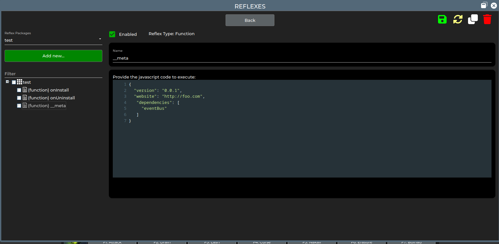

# The base repository for the Iron Realms Nexus Repository

Welcome to the default repository for the Iron Realms Nexus client. In this repository, we track the location of packages for the Nexus client and provide the required metadata for the [Nexus Package Manager](https://keneanung.github.io/nexus-package-manager/). This list is a community project and in no way endorsed or linked to the company Iron Realms.

## Adding your package

If you want to have your package listed here, you have two options.

You can either create a Pull Request that adds a line to the [`packages.yaml`](https://github.com/keneanung/nexus-package-repository/blob/development/packages.yaml) file. The format is `"<readable package name>": <url to the NXS file>`. The published list at <https://keneanung.github.io/nexus-package-repository> is updated once a day, though I will try to remember to update it after merging a PR as well.

The second option is to add an [issue](https://github.com/keneanung/nexus-package-repository/issues/new?template=new_package.yml) about the addition. Please note that this requires additional manual steps for us and may require some time.

## Disallowed packages

This repository does not allow packages that create spam, contain malware or are forbidden by the respective game designer's rules in a game. Breaking this rule results in the immediate deletion of the offending package from the listing. For special cases, the removal of all packages of an author is also possible.

## Removal of packages

Packages can be removed from this package at any time without further notice at the maintainer's discretion without any reason given. In case you notice any of the listed packages falls in the `forbidden` category above, please open a Pull Request or [an issue](https://github.com/keneanung/nexus-package-repository/issues/new?template=package_takedown.yml).

## Getting your package to work with the package listing

The good news is: To have a package included in the listing, no changes to your package file are necessary. Any default exported package from Nexus will work.

However, to make the package work optimally with the package manager, you should consider including some additional data. This data can be added to the JSON of the NXS file directly at the top level or as a top level function named `__meta` that only contains an JSON object with the given keys.

- `version`: The version of the package. This `string` allows the package manager to notify the user of updates of installed packages. Ideally, this is a [semantic version](https://semver.org/). If no version is found in the package, the file is hashed and its start is used as a version string to recognize updates.
- `dependencies`: An array of `strings`. Each string is the package name of another package that this package depends on as it is given **inside the NXS package**. This allows the package manager to check for installed dependencies and possibly install them first.
- `website`: If you have a homepage with more information about the package, add this value.

Examples:

An example for additional keys in the NXS-JSON object directly:

```json
{
    "type": "group",
    "name": "test",
    "enabled": true,
    "items": [
        {
            "type": "function",
            "name": "onInstall",
            "enabled": true,
            "code": "// Place any code here you'd like to autorun when the package is installed"
        },
        {
            "type": "function",
            "name": "onUninstall",
            "enabled": true,
            "code": "// Place any code here you'd like to autorun when the package is uninstalled"
        }
    ],
    "description": "",
    "version": "1.0.0",
    "website": "https://foo.com",
    "dependencies": [
        "eventBus"
    ]
}
```

An example for a top-level `__meta` function that only contains the the meta data:

```json
{
    "type": "group",
    "name": "test",
    "enabled": true,
    "items": [
        {
            "type": "function",
            "name": "onInstall",
            "enabled": true,
            "code": "// Place any code here you'd like to autorun when the package is installed"
        },
        {
            "type": "function",
            "name": "onUninstall",
            "enabled": true,
            "code": "// Place any code here you'd like to autorun when the package is uninstalled"
        },
        {
            "type": "function",
            "name": "__meta",
            "enabled": true,
            "code": "{\n  \"version\": \"0.0.1\",\n  \"website\": \"http://foo.com\",\n   \"dependencies\": [\n     \"eventBus\"\n   ]\n}"
        }
    ],
    "description": ""
}
```

In the UI, the function looks like this:
